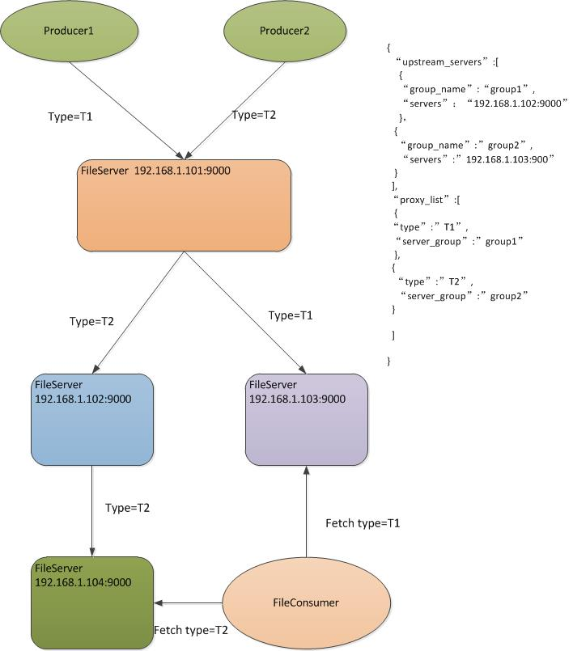

File Reverse Proxy Server
===


主配置
---
```
{
   "workdir":"/Users/tiger/ttt2",
   "mode":0,
   "port":9000,
   "ip":"127.0.0.1",
   "fileTTL":5,
   "dbDir":"/Users/tiger/codespace/workspace/ant/db"
}

```
反向代理配置
---

```
{
   "upstream_servers":[//upstream 服务器组
      {
         "group_name":"group1",
         "servers":"127.0.0.1:9001"
      }
   ],
   "proxy_list":[//反向代理映射配置
      {
         "type":"ngixnx",
          "server_group":"group1"
      },
      {
         "type":"type3,type4",
         "server_group":"group1"
      }
   ],
   "upstream_thread_number":10
}
```

订阅模式
---
```
	ConsumerConfig config = new ConsumerConfig();
    config.setBrokerIp("54.223.81.103");
    config.setBrokerPort(9000);
    config.setGroupId("group1");
    config.setConsumerId("consumer1");
    config.setMaxLocalCache(1);
    config.setTypes(new String[]{"gfs"});
    config.setWorkDir("/Users/tiger/consumer");
    FileConsumer consumer = new FileConsumer(config,new FileDownloadProcessor(){
      @Override
      public void onFileReceived(FileMeta meta, File file) {
        try {
          System.out.println("receive file "+file.getAbsolutePath());
          Thread.sleep(80*1000);
          System.out.println("file processed "+file.getAbsolutePath());
        } catch (InterruptedException e) {
          e.printStackTrace();
        }
      }
      
    });
    consumer.run();
    
  }


```

JAVA客户端文件上传
---
```
 FileConnection conn = FileConnection.openConnection("127.0.0.1", 9000);
 conn.sendFile("testtype", "2016/06", new File("your file path"));
 conn.close()

```
Python客户端文件上传
---
```
from  fileclient import FileClient
client=FileClient("127.0.0.1",9000)
client.connect()
client.sendFile("/path/of/file","filetype","file/store/path")
client.close()

```